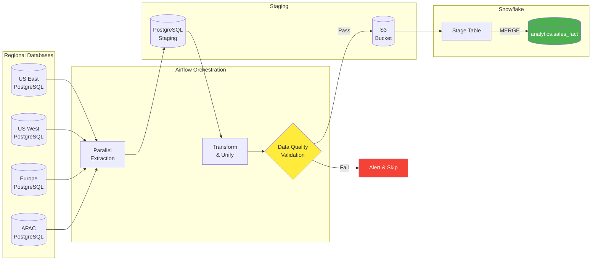
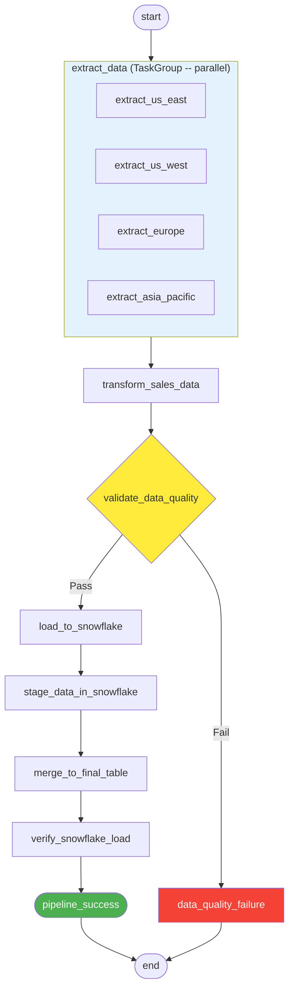
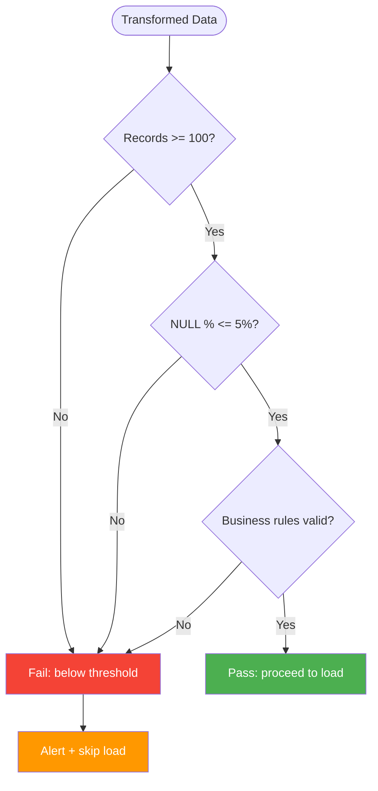
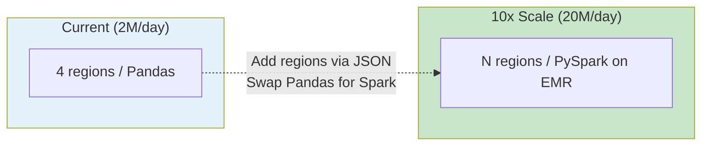

# Retail Sales ETL Pipeline

**Production-grade Apache Airflow pipeline** that extracts sales data from multiple regional PostgreSQL databases, transforms it into a unified schema, validates data quality, and loads it into Snowflake for enterprise analytics.

| | |
|---|---|
| **Schedule** | Daily at 06:00 UTC |
| **SLA** | 2 hours |
| **Throughput** | ~2M records/day across 4 regions |
| **Runtime** | ~40 minutes |
| **Orchestrator** | Apache Airflow 2.5+ |
| **Warehouse** | Snowflake |

---

## Table of Contents

- [Architecture](#architecture)
- [Project Structure](#project-structure)
- [Tech Stack](#tech-stack)
- [DAG Flow](#dag-flow)
- [Features](#features)
- [Quick Start](#quick-start)
- [Configuration](#configuration)
- [Data Quality](#data-quality)
- [Testing](#testing)
- [Performance](#performance)
- [Troubleshooting](#troubleshooting)
- [Security](#security)
- [Future Enhancements](#future-enhancements)

---

## Architecture

### High-Level Data Flow



### End-to-End Pipeline

```
 Regional DBs          Airflow                 Staging              Snowflake
 ============     ================        ===============      ===============

 +-----------+    +--------------+
 | US East   |--->| extract_     |
 | PostgreSQL|    | us_east      |---+
 +-----------+    +--------------+   |
                                     |   +-------------+    +-----------+    +----------+
 +-----------+    +--------------+   +-->| PostgreSQL  |--->|    S3     |--->| Staging  |
 | US West   |--->| extract_     |---+   | staging     |    | (CSV)    |    | table    |
 | PostgreSQL|    | us_west      |       +------+------+    +----------+    +----+-----+
 +-----------+    +--------------+              |                                |
                                          +-----v------+                   +-----v-----+
 +-----------+    +--------------+        | Transform  |                   |   MERGE   |
 | Europe    |--->| extract_     |---+    | & validate |                   | (upsert)  |
 | PostgreSQL|    | europe       |   |    +------------+                   +-----+-----+
 +-----------+    +--------------+   |                                           |
                                     |                                     +-----v-----+
 +-----------+    +--------------+   |                                     | analytics |
 | APAC      |--->| extract_     |---+                                     | .sales_   |
 | PostgreSQL|    | asia_pacific |                                         | fact      |
 +-----------+    +--------------+                                         +-----------+
```

---

## Project Structure

```
airflow_etl_pipeline/
|
|-- dags/
|   +-- retail_sales_etl_dag.py        # Main DAG: extraction, transform, validate, load
|
|-- config/
|   |-- region_config.json             # Dynamic region definitions (add regions here)
|   +-- airflow_config_setup.py        # Connection & variable setup helpers
|
|-- tests/
|   +-- test_retail_sales_etl.py       # Unit tests: DAG structure, transforms, quality
|
|-- docs/
|   |-- architecture_diagrams.md       # Mermaid architecture diagrams
|   +-- interview_prep.md              # Interview Q&A guide
|
|-- envs/
|   +-- env.template                   # Environment variable template
|
|-- .github/workflows/
|   +-- ci.yml                         # CI: lint, DAG validation, tests
|
|-- Dockerfile                         # Airflow image with project deps
|-- docker-compose.yml                 # Local dev stack (Airflow + PostgreSQL)
|-- requirements.txt                   # Pinned Python dependencies
|-- .gitignore
+-- README.md
```

---

## Tech Stack

| Layer | Technology | Purpose |
|-------|-----------|---------|
| **Orchestration** | Apache Airflow 2.5+ | DAG scheduling, task management, retries |
| **Source DBs** | PostgreSQL 12+ | 4 regional transactional databases |
| **Staging DB** | PostgreSQL 12+ | Intermediate transformation storage |
| **Processing** | Python / Pandas | Data consolidation, cleaning, enrichment |
| **Object Storage** | AWS S3 | Staging area for Snowflake COPY |
| **Data Warehouse** | Snowflake | Final analytics tables with clustering |
| **Bulk Insert** | SQLAlchemy | Parameterized batch writes to PostgreSQL |
| **Testing** | pytest | Unit, config, and integration tests |
| **CI/CD** | GitHub Actions | Lint (ruff), DAG validation, test suite |
| **Containers** | Docker / Compose | Reproducible local development |

---

## DAG Flow



**Key settings:**

```python
schedule_interval = '0 6 * * *'   # Daily at 06:00 UTC
max_active_runs   = 1             # Sequential execution only
retries           = 2             # With exponential backoff (5 / 10 / 20 min)
sla               = 2 hours      # Alert if exceeded
```

---

## Features

### Parallel Extraction
Four regional databases are extracted concurrently inside an Airflow TaskGroup, cutting extraction time from ~40 min (sequential) to ~10 min.

### Config-Driven Dynamic DAG
Regions are defined in `config/region_config.json`. Adding a new region requires **zero code changes** -- just add a JSON entry and an Airflow connection:

```json
{
  "name": "latin_america",
  "conn_id": "postgres_latin_america",
  "display_name": "LATAM",
  "timezone": "America/Sao_Paulo",
  "extraction_timeout_minutes": 30,
  "retries": 3
}
```

### Comprehensive Transformations
| Step | Description |
|------|------------|
| Deduplication | Remove duplicate `sale_id` records |
| Type standardization | Cast dates, decimals consistently |
| Null handling | Fill missing `discount_amount` / `tax_amount` with 0 |
| Derived columns | `net_amount`, `gross_profit` |
| Partition columns | `sale_year`, `sale_month`, `sale_day` for Snowflake |
| Region normalization | `us_east` -> `US-EAST` (config-driven) |
| Business rules | Filter `quantity > 0`, `unit_price > 0`, `total_amount > 0` |

### Idempotent Loads
- MERGE (upsert) into `analytics.sales_fact` -- safe for reruns
- Batch ID (`etl_batch_id`) tracks each execution date
- DELETE + INSERT staging pattern ensures clean intermediate state

### Parameterized SQL
All runtime values (`target_date`, `batch_id`, `region`) use `%s` placeholders via `cursor.execute(query, params)` -- no f-string interpolation in SQL.

### Fail-Fast Validation
`BranchPythonOperator` gates the Snowflake load behind multi-layer quality checks. On failure, the pipeline skips loading and sends alerts.

---

## Quick Start

### Option A: Docker (recommended)

```bash
git clone <repo-url> && cd airflow_etl_pipeline

# Start Airflow + PostgreSQL
docker compose up -d

# Open Airflow UI
open http://localhost:8080    # admin / admin
```

### Option B: Local

```bash
# 1. Install dependencies
pip install -r requirements.txt

# 2. Initialize Airflow
airflow db init

# 3. Configure connections & variables
cp envs/env.template .env
source .env
python config/airflow_config_setup.py

# 4. Deploy DAG
cp dags/retail_sales_etl_dag.py $AIRFLOW_HOME/dags/

# 5. Validate & start
airflow dags list
airflow dags test retail_sales_etl_pipeline 2024-01-15
airflow dags unpause retail_sales_etl_pipeline
```

---

## Configuration

### Airflow Connections

| Connection ID | Type | Host | Purpose |
|--------------|------|------|---------|
| `postgres_us_east` | Postgres | us-east-db.company.com | US East regional DB |
| `postgres_us_west` | Postgres | us-west-db.company.com | US West regional DB |
| `postgres_europe` | Postgres | eu-db.company.com | Europe regional DB |
| `postgres_asia_pacific` | Postgres | apac-db.company.com | APAC regional DB |
| `postgres_default` | Postgres | staging-db.company.com | Staging DB |
| `snowflake_default` | Snowflake | -- | Data warehouse |
| `aws_default` | AWS | -- | S3 access |

### Airflow Variables

Set via **Admin -> Variables** in the Airflow UI:

| Variable | Default | Description |
|----------|---------|-------------|
| `S3_STAGING_BUCKET` | `data-pipeline-staging` | S3 bucket for CSV staging |
| `ALERT_EMAIL_LIST` | `data-eng@company.com` | Failure notification recipients |
| `SNOWFLAKE_WAREHOUSE` | `ETL_WH` | Snowflake compute warehouse |

### Region Config (`config/region_config.json`)

Each entry generates an extraction task dynamically:

```json
{
  "regions": [
    {
      "name": "us_east",
      "conn_id": "postgres_us_east",
      "display_name": "US-EAST",
      "timezone": "US/Eastern",
      "extraction_timeout_minutes": 30,
      "retries": 3
    }
  ]
}
```

---

## Data Quality

### Validation Gates

Quality checks run **before** any data reaches Snowflake:

| Check | Threshold | On Failure |
|-------|-----------|------------|
| Minimum record count | >= 100 | Pipeline branches to failure path |
| NULL % in critical columns | < 5% | Pipeline branches to failure path |
| Quantity validation | > 0 | Filtered during transformation |
| Price validation | > 0 | Filtered during transformation |
| Amount sanity | 0.5x -- 2x of `qty * price` | Filtered during transformation |

### Validation Flow



---

## Testing

```bash
# Run full test suite
pytest tests/ -v

# Run specific test class
pytest tests/test_retail_sales_etl.py::TestRegionConfig -v
pytest tests/test_retail_sales_etl.py::TestDataTransformation -v
```

### Test Coverage

| Class | Tests | What it covers |
|-------|-------|---------------|
| `TestDAGStructure` | 5 | DAG loads, schedule, args, task count, dependencies |
| `TestRegionConfig` | 5 | Config file validity, required fields, uniqueness, task generation |
| `TestDataTransformation` | 5 | Deduplication, null handling, derived columns, partitions, regions |
| `TestDataQuality` | 3 | Record thresholds, null %, business rule validation |
| `TestExtractionLogic` | 2 | Parameterized query format, error handling |
| `TestSnowflakeOperations` | 2 | MERGE structure, upsert logic |
| `TestMonitoringAndLogging` | 2 | XCom metadata, transformation metadata |
| `TestErrorScenarios` | 2 | Zero records, partial region failure |
| `TestPerformance` | 1 | Parallel vs sequential extraction benefit |

### CI Pipeline (`.github/workflows/ci.yml`)

Runs on every push/PR to `main`:
1. **Lint** -- `ruff check dags/ tests/ config/`
2. **DAG syntax** -- Validates DAG parses without errors
3. **Tests** -- `pytest tests/ -v`

---

## Performance

| Phase | Duration | Details |
|-------|----------|---------|
| Extraction (parallel) | ~10 min | 4 regions at ~2.5 min each |
| Transformation | ~15 min | Pandas + SQLAlchemy bulk insert |
| Validation | ~5 min | SQL-based quality checks |
| Snowflake Load | ~10 min | S3 COPY + MERGE upsert |
| **Total** | **~40 min** | **Well under 2-hour SLA** |

### Scaling Strategy



| Component | Current | At 10x |
|-----------|---------|--------|
| Extraction | 4 parallel regions | N parallel (config-driven) |
| Transform | Pandas (single node) | PySpark on EMR/Databricks |
| S3 staging | Single file | Partitioned files |
| Snowflake | MEDIUM warehouse | LARGE + auto-scaling |

---

## Troubleshooting

### Common Issues

**Connection timeout to regional DB**
```
Error: "could not connect to server: Connection timed out"
```
Check network/firewall rules. Increase `connect_timeout` in the Airflow connection.

**Data quality validation failure**
```
Error: "Record count 45 is below threshold 100"
```
Investigate source DB for missing data. Check regional holidays or date filter issues.

**Snowflake load timeout**
```
Error: "SQL execution timeout"
```
Scale up the Snowflake warehouse. Check for table locks.

### Recovery

```bash
# Rerun a specific date
airflow dags backfill retail_sales_etl_pipeline \
    --start-date 2024-01-15 --end-date 2024-01-15

# Clear failed tasks and retry
airflow tasks clear retail_sales_etl_pipeline \
    --task-regex '.*' \
    --start-date 2024-01-15 --end-date 2024-01-15
```

```sql
-- Rollback a batch in Snowflake, then rerun
DELETE FROM analytics.sales_fact WHERE etl_batch_id = '20240115';
```

---

## Security

| Area | Implementation |
|------|---------------|
| **Credentials** | Stored in Airflow connections (backed by Secrets Manager / Vault) |
| **SQL injection** | All queries use parameterized `%s` placeholders |
| **Network** | VPC peering for DB access, SSL/TLS for all connections |
| **Encryption** | Data at rest (S3 SSE, Snowflake), data in transit (TLS) |
| **Access control** | Snowflake RBAC roles, Airflow RBAC, least-privilege IAM |
| **Secrets in repo** | `.gitignore` excludes `.env`, credentials, and key files |

---

## Future Enhancements

- **Real-time streaming** -- Kafka/Kinesis ingestion alongside batch
- **Advanced monitoring** -- Datadog/Prometheus metrics, anomaly detection dashboards
- **PySpark transformation** -- Replace Pandas for datasets > 1M records
- **Incremental extraction** -- CDC-based extraction instead of full daily scan
- **Schema registry** -- Formal schema evolution management
- **Cost optimization** -- Snowflake auto-suspend, S3 lifecycle policies

---

## Contact

| | |
|---|---|
| **Maintainer** | Sanath |
| **Team** | Data Engineering |
| **Slack** | `#data-engineering` |
