# Architecture Diagrams - Retail Sales ETL Pipeline

## 1. High-Level Data Flow


## 2. Detailed Airflow DAG Structure


## 3. Data Transformation Flow


## 4. Data Quality Validation Flow


## 5. Snowflake Load Strategy (MERGE Upsert)


## 6. Error Handling & Retry Strategy


## 7. Monitoring & Observability


## 8. Scaling Strategy Comparison


## 9. Regional Extraction Pattern (Parallel)

```mermaid
gantt
    title Parallel Extraction Timeline (40 min → 10 min)
    dateFormat HH:mm
    axisFormat %H:%M
    
    section Sequential (Old)
    US East      :a1, 06:00, 10m
    US West      :a2, after a1, 10m
    Europe       :a3, after a2, 10m
    Asia Pacific :a4, after a3, 10m
    
    section Parallel (New)
    US East      :b1, 06:00, 10m
    US West      :b2, 06:00, 10m
    Europe       :b3, 06:00, 10m
    Asia Pacific :b4, 06:00, 10m
```



## 10. Cost Breakdown (Monthly)


---

## Key Metrics Dashboard

| Metric | Current | Target | Status |
|--------|---------|--------|--------|
| **Pipeline Duration** | 40 min | < 120 min | ✅ |
| **Success Rate** | 99.5% | > 99% | ✅ |
| **Record Volume** | 2M/day | - | ✅ |
| **Data Quality** | < 0.1% errors | < 1% | ✅ |
| **Cost** | $500/month | < $1000 | ✅ |
| **Parallelism** | 4 regions | Scalable | ✅ |

---

## Technologies Used

```
┌─────────────────────────────────────────────────┐
│              Orchestration Layer                │
│  ┌───────────────────────────────────────────┐ │
│  │       Apache Airflow 2.5.3                │ │
│  │  • TaskGroups for parallel execution      │ │
│  │  • BranchOperator for validation routing  │ │
│  │  • XCom for inter-task communication      │ │
│  └───────────────────────────────────────────┘ │
└─────────────────────────────────────────────────┘

┌─────────────────────────────────────────────────┐
│               Source & Staging                  │
│  ┌───────────────────────────────────────────┐ │
│  │  PostgreSQL 12+                           │ │
│  │  • 4 regional databases (sources)         │ │
│  │  • 1 staging database (transformation)    │ │
│  └───────────────────────────────────────────┘ │
└─────────────────────────────────────────────────┘

┌─────────────────────────────────────────────────┐
│            Transformation Layer                 │
│  ┌───────────────────────────────────────────┐ │
│  │  Python 3.9 + Pandas                      │ │
│  │  • Data consolidation & cleaning          │ │
│  │  • Business logic transformation          │ │
│  │  • SQLAlchemy for bulk operations         │ │
│  └───────────────────────────────────────────┘ │
└─────────────────────────────────────────────────┘

┌─────────────────────────────────────────────────┐
│              Intermediate Storage               │
│  ┌───────────────────────────────────────────┐ │
│  │  AWS S3                                   │ │
│  │  • Staging area for Snowflake COPY       │ │
│  │  • CSV format with compression            │ │
│  └───────────────────────────────────────────┘ │
└─────────────────────────────────────────────────┘

┌─────────────────────────────────────────────────┐
│               Data Warehouse                    │
│  ┌───────────────────────────────────────────┐ │
│  │  Snowflake                                │ │
│  │  • Staging tables for COPY                │ │
│  │  • Final analytics tables with clustering │ │
│  │  • MERGE for idempotent loads             │ │
│  └───────────────────────────────────────────┘ │
└─────────────────────────────────────────────────┘
```
